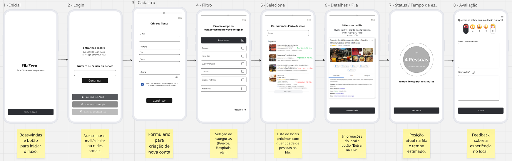

# ihcux-lista-10-
## Icaro Ferreira de Oliveira

## Breve Descrição da Ideia
 - O FilaZero é uma solução para dispositivos móveis projetada para otimizar o tempo dos usuários, permitindo que visualizem estabelecimentos próximos, verifiquem o tempo de espera em tempo real e entrem em filas virtualmente. O objetivo principal é eliminar a necessidade de espera física em locais como bancos, hospitais e restaurantes.Explicação das Telas CriadasO protótipo de baixa fidelidade foca na estrutura e no fluxo de navegação, composto pelas seguintes interfaces:

1. Inicial: Ponto de entrada com a proposta de valor e botão para iniciar a jornada.
2. Login: Autenticação do usuário via credenciais diretas ou redes sociais.
3. Cadastro: Coleta de dados básicos para novos usuários (nome, e-mail, telefone e senha).
4. Filtro: Seleção de categorias de estabelecimentos para busca personalizada.
5. Selecione: Listagem de locais próximos exibindo o tempo estimado de espera e lotação atual.
6. Detalhes / Fila: Informações completas do local e botão de ação para ingressar na fila virtual.
7. Status / Tempo de Espera: Monitoramento da posição atual na fila e contagem regressiva para o atendimento.
8. Avaliação: Coleta de feedback sobre a experiência no estabelecimento.

## Fluxo Principal do Usuário
O caminho padrão realizado pelo usuário no FilaZero segue as seguintes etapas:
1. Acesso e Identificação: O usuário inicia na tela de boas-vindas, realiza o Login ou Cadastro para acessar as funcionalidades personalizadas.
2. Busca e Filtragem: Através da tela de Filtro, o usuário escolhe a categoria de serviço desejada (ex: Restaurantes ou Bancos).
3. Seleção do Local: O sistema exibe uma lista de estabelecimentos próximos com o tempo estimado de espera; o usuário seleciona o local de interesse.
4. Engajamento na Fila: Na tela de Detalhes, o usuário visualiza as informações do local e confirma sua entrada na fila virtual.
5. Monitoramento: O usuário acompanha em tempo real sua posição na fila e recebe a estimativa de quantos minutos faltam para o atendimento.
6. Conclusão e Feedback: Após o atendimento, o usuário finaliza a experiência deixando uma avaliação sobre o local visitado.

## 📸 Protótipo

